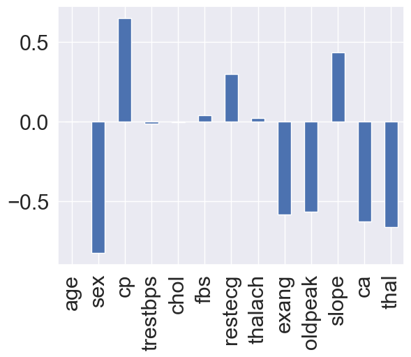

# Heart Disease Classification

A machine learning project for predicting heart disease based on patient health data.

## Dataset
The dataset comes from the [UCI Machine Learning Repository](https://archive.ics.uci.edu/ml/datasets/heart+Disease).
It contains patient medical records (age, sex, blood pressure, cholesterol, max heart rate, etc.) and a target variable indicating whether heart disease was present.

## Methods
- Exploratory Data Analysis (EDA)
- Data preprocessing
- Training multiple classification models:
  - Logistic Regression
  - Random Forest
  - K-Nearest Neighbors
- Model evaluation using:
  - Accuracy, Precision, Recall, F1
  - Confusion Matrix
  - Cross-validation metrics
  - ROC Curve
- Feature importance analysis

## Results
The best performing model was **Logistic Regression**.

- **Cross-validation (5-fold):**
  - Accuracy: 0.845
  - Precision: 0.821
  - Recall: 0.921
  - F1-score: 0.867

- **Hold-out test set (20% split):**
  - Accuracy: 0.885

### Visualizations
Confusion Matrix:  


Cross-validation Metrics:  


ROC Curve:  


Feature Importance:  


## How to run the project
1. Clone this repository or download it as a ZIP.  
2. Install the required dependencies:
   ```bash
   pip install -r requirements.txt
   ```
